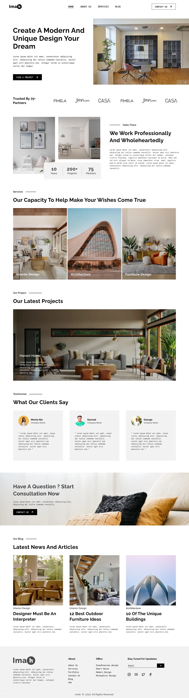
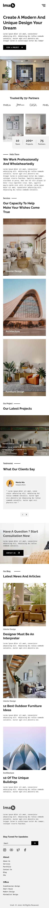

# Architecture — Современный многостраничный лендинг

Проект стильного и адаптивного сайта для архитектурного бюро. Выполнен в рамках обучения фронтенд-разработке с упором на автоматизацию сборки и семантическую верстку.

## 🚀 Демо

Посмотреть проект вживую: [https://qooler-667.github.io/Architecture/](https://qooler-667.github.io/Architecture/)

## 🛠 Технологии и инструменты

- **HTML5**: семантическая разметка, использование ARIA-атрибутов для доступности.
- **SCSS**: модульная структура стилей, использование миксинов, переменных и функций.
- **Gulp**: автоматизация сборки (компиляция SASS, оптимизация изображений, создание SVG-спрайтов, Browsersync).
- **BEM (БЭМ)**: методология именования классов для чистоты и масштабируемости кода.
- **JavaScript**: реализация мобильного меню, слайдеров и динамических элементов.
- **GitHub Pages**: настроен автоматический деплой из папки `/docs`.

## 📦 Особенности проекта

- **Адаптивность**: сайт корректно отображается на всех типах устройств (от смартфонов до десктопов).
- **Оптимизация**: все изображения переведены в формат `.webp` для быстрой загрузки.
- **SVG Sprites**: иконки собраны в один стек для уменьшения количества HTTP-запросов.
- **Pixel Perfect**: верстка максимально приближена к макету с проверкой визуальной логики.

## 💻 Как запустить локально

1. Клонировать репозиторий:
   ```bash
   git clone [https://github.com/Qooler-667/Architecture.git](https://github.com/Qooler-667/Architecture.git)
   ```
2. Установить зависимости:
   npm install

3. Запустить режим разработки:
   gulp

   ## 🎨 Дизайн-макеты

   Проект реализован в соответствии со следующими макетами (Desktop и Mobile версии):

|                     Desktop Version                     |                    Mobile Version                     |
| :-----------------------------------------------------: | :---------------------------------------------------: |
|  |  |

> **Примечание:** Верстка выполнена с максимальным соблюдением визуальной логики, отступов и типографики оригинального макета.
